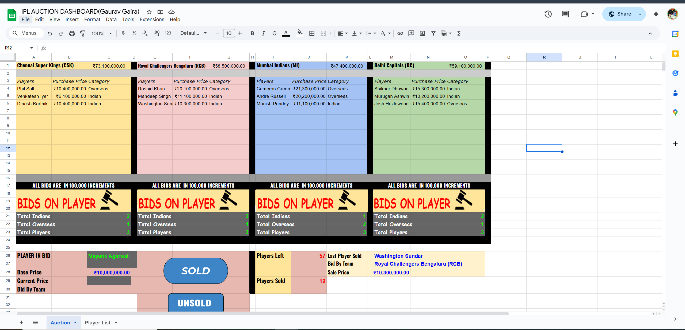

# IPL Auction Dashboard — Google Sheets & Apps Script Project

---

## Overview

The IPL Auction Dashboard is a comprehensive, automated tool built in Google Sheets designed to simulate and track the Indian Premier League (IPL) auction process in real-time. It provides teams with instant insights into player bids, budget utilization, category distribution (Indian vs Overseas players), and auction progress.

By leveraging Google Sheets advanced formulas and Google Apps Script automation, this dashboard combines the power of spreadsheets with custom scripting to build an interactive and user-friendly auction management system.

---

## Problem Statement

Managing an IPL auction involves handling multiple players, varying bid increments, team budgets, player categories, and tracking real-time bid statuses. Doing this manually is tedious and error-prone.

This project automates these workflows to:

- Track player sale status and prices dynamically  
- Calculate total spend per team with formula-driven aggregation  
- Maintain count of players bought in each category per team  
- Identify current players in bid, players left to be sold, and last sold player automatically  
- Provide an interactive dashboard with buttons to refresh data and streamline auction management  

---

## Features & Functionality

### 1. Dynamic Data Tracking with Formulas

- **Player Data Table:** Contains details like player name, base price, selling price, category, sale status, and buyer.  
- **Formulas Used:**  
  - `VLOOKUP` to fetch player details dynamically  
  - `SUMIF` to calculate total purchase price per team  
  - `COUNTIF` to count players by category and status (sold/unsold)  
- **Currency Formatting:** All price fields use Indian Rupee formatting with thousand separators for readability.

### 2. Google Apps Script Automation

- **Buttons for Interactivity:** Custom buttons trigger Apps Script functions to refresh dashboard stats without manual recalculation.  
- **Real-Time Auction Status Updates:**  
  - Identify the current player in bidding process  
  - Display the last player sold and their sale price  
  - Calculate number of players left to be auctioned  
- **Data Validation & Error Handling:** Scripts validate inputs and ensure auction progress is consistent.

### 3. Team Budget & Category Insights

- **Total Spend by Each Franchise:** Automatically updates as bids are entered.  
- **Player Composition:** Separate counts of Indian and Overseas players per team to monitor squad balance.  
- **Auction Progress:** Summaries show how many players remain and how many are sold.

### 4. Clean, Intuitive UI

- Organized tabs for:  
  - Player list & bid management  
  - Dashboard with key metrics and team spend  
- Conditional formatting highlights:  
  - Sold vs unsold players  
  - High bids in different colors for quick visual cues  
- Currency and data formatting ensure clarity.

---
## IPL AUCTION DASHBOARD:

## Technical Details

| Technology        | Description                                  |
|-------------------|----------------------------------------------|
| **Google Sheets** | Used for data storage, formulas, and dashboard visualization. |
| **Formulas Used** | `VLOOKUP`, `SUMIF`, `COUNTIF`, `IF`, and nested formula logic to automate calculations. |
| **Google Apps Script** | Custom scripts written in JavaScript to automate dashboard refresh, update auction status, and add interactive buttons. |
| **Data Validation** | Restricts inputs and maintains data integrity during auction simulation. |
| **UI/UX**         | Conditional formatting, color coding, and buttons to improve usability and readability. |

---

## Project Structure

- `Player List` tab: All player info, base price, bid price, category, status, and buying team.  
- `Dashboard` tab: Summary tables showing total team spends, player counts, and auction progress.  
- Apps Script functions tied to buttons:  
  - **Refresh Dashboard:** Recalculates totals and updates auction status.  
  - **Update Bids:** Automates bid increment calculations and updates selling prices.  

---

## How to Use

1. **Open the Google Sheet** (link in repo or make your own copy).  
2. **Enter player bids** and update player sale status in the “Player List” tab.  
3. Click the **“Refresh Dashboard” button** to update totals, counts, and auction metrics.  
4. Monitor team spends and player categories on the Dashboard tab.  
5. Use the dashboard insights to make strategic auction decisions or simulate auction outcomes.

---

## Challenges Faced & Learnings

- Handling real-time data updates and synchronizing between formulas and scripts.  
- Managing dynamic range sizes and formula references while new players were added.  
- Implementing user-friendly interactive buttons within Google Sheets using Apps Script.  
- Applying best practices for script efficiency and spreadsheet performance.  
- Designing a clean UI inside Google Sheets using conditional formatting.

---

## Conclusion

This IPL Auction Dashboard project showcases a strong integration of spreadsheet skills and scripting automation to solve a complex, real-world problem in sports auction management. It demonstrates expertise in:

- Building scalable, formula-driven data models  
- Creating intuitive and interactive user interfaces inside Google Sheets  
- Writing efficient and reliable Apps Script code for automation  
- Combining technical skills with domain knowledge to deliver actionable insights

This project not only strengthens spreadsheet and scripting proficiency but also highlights problem-solving ability and attention to user experience — qualities highly valued by recruiters in data-driven and tech roles.

---

*Happy Auctioning!* 🚀

